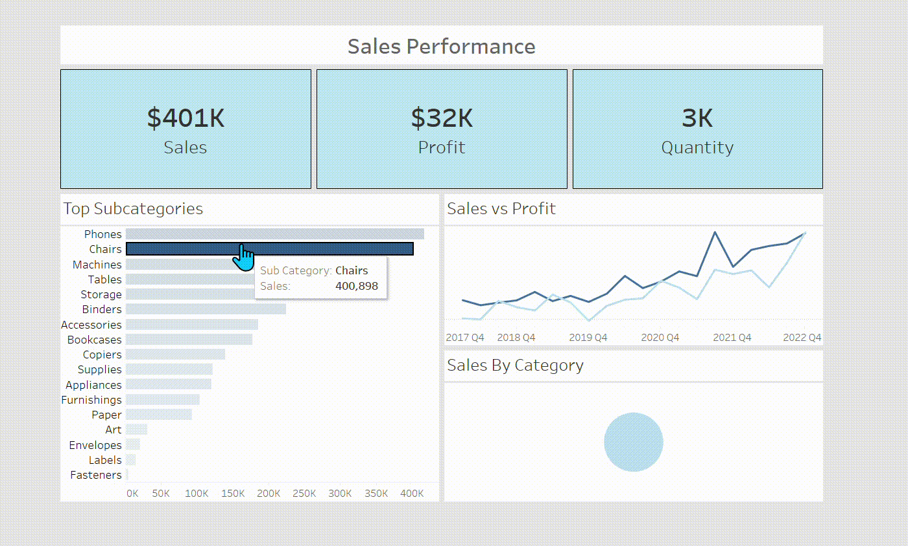

---
# 📊 Strategic Sales Performance Analysis

### 🎥 Dashboard Demonstration

---

### 🚀 Introduction

- 🔍 This project serves as a comprehensive diagnostic tool designed to transform raw transactional data into a high-level strategic narrative.
- 📈 By synthesizing disparate data points, the dashboard provides a unified view of organizational health and market positioning.

### 🏛️ Background

- 🕰️ The analytical scope encompasses a robust five-year window, specifically from **2017 Q4** through **2022 Q4**.
- 🌐 In an era of data-driven competition, this analysis was initiated to uncover the underlying causalities behind revenue fluctuations and category dominance.

### 🛠️ Tools I Used

- 🎨 **Tableau:** Employed as the primary engine for visual synthesis and interactive storytelling.
- ⚙️ **Data Preparation:** Rigorous cleaning and transformation of datasets to ensure structural integrity.
- 📊 **Calculated Fields:** Utilized to derive precise Key Performance Indicators (KPIs) from raw metrics.

### 🧪 The Analysis

- 💰 **Aggregate Revenue:** The enterprise successfully realized a total sales volume of **$2,844K**.
- 💵 **Profitability Dynamics:** Total profit stands at **$303K**, revealing a net margin that suggests opportunities for operational refinement.
- 📦 **Volume Throughput:** A total of **46K** units were processed, indicating high market demand and logistical activity.
- 🔝 **Subcategory Leadership:** High-value sectors are led by **Phones** (approx. **$400K**) and **Chairs** (approx. **$350K**), which function as the primary economic pillars of the portfolio.
- 📉 **Temporal Trends:** The "Sales vs Profit" chart highlights a significant surge in revenue toward the end of **2022**, though profit margins show a higher degree of volatility.
- 🍕 **Categorical Segmentation:** The market share is distributed across three pillars with values of **1,018,985**, **958,335**, and **867,149**.

### 💡 What I Learned

- 🧠 **Cognitive Load Optimization:** I refined the art of visual hierarchy, ensuring that critical KPIs—Sales, Profit, and Quantity—occupy the primary focal points of the user interface.
- 📐 **Data-to-Ink Ratio:** Learned to use color gradients (specifically the "Blues" palette) to intuitively signal value intensity without cluttering the observer's perception.

### 🏁 Conclusions

- ✅ **Expansion Potential:** The consistent upward trend in sales through **2022** indicates a strong product-market fit and a scalable trajectory.
- ⚠️ **Profit Elasticity:** The divergence between sales growth and profit stability necessitates a deeper investigation into discount structures or rising procurement costs.
- 🎯 **Strategic Prioritization:** Resources should be disproportionately allocated to high-performing subcategories like **Phones** and **Chairs** to maximize the return on invested capital.
